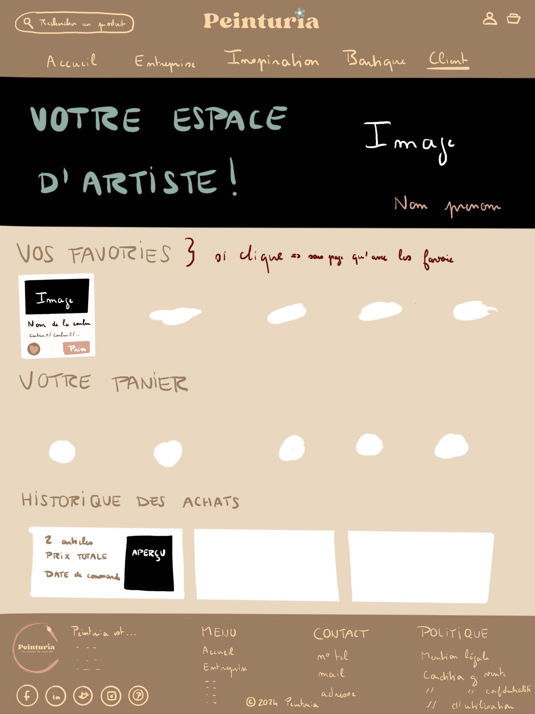

# Webcat - Site de l'entreprise Peinturia

## Présentation de l’application

### **Description**
Peinturia est une application web dédiée aux passionnés d'art, amateurs comme professionnels, qui souhaitent explorer, apprendre et se fournir en matériaux de qualité pour leurs créations. Sa mission est de démocratiser l'accès à des outils artistiques et d'inspirer la créativité, tout en valorisant des pratiques respectueuses de l'environnement.

### **Installation**
Pour avoir les données, il faut exécuter tables.sql puis data.sql et changer les credentials (fichier dans le dossier Models) afin de relier votre base de données. Puis, il faut mettre le dossier du site web dans votre serveur web.

### **Comptes pour tester la connexion**
* **Compte client** : camelia@gmail.com (avec n'importe quel mot de passe).
* **Compte administrateur** : admin@gmail.com (avec n'importe quel mot de passe).
Le principe de mot de passe n'a pas encore été développé pour faciliter les tests de développement.

###  **Fonctionnalités principales**
**Site en globalité**
* Une navigation intuitive permettant d'explorer facilement les sections du site.

**Page Palette**
* Permet de copier directement le code hexadécimal d’une couleur en cliquant sur celle-ci.

**Page Œuvres**
* Utiliser une pipette pour cliquer sur une partie d’une œuvre et obtenir instantanément le code hexadécimal de la couleur sélectionnée.
* Naviguer facilement parmi les œuvres grâce à un système de pagination.

**Header**
* Se connecter à son compte en cliquant sur l’icône "bonhomme".
* Une fois connecté, accéder à des fonctionnalités comme ses favoris, son panier, et son historique d’achats ou de navigation.

**Page Boutique**
* Une barre de recherche multimodale permettant de trouver des produits selon des critères comme le type, le prix, la couleur ou l’inspiration artistique.
* Des filtres avancés pour une recherche précise et intuitive.
* Une fiche technique s’affiche lorsqu’on clique sur un produit, avec une option de fermeture grâce à une croix.
* La fonctionnalité permettant d’ajouter des articles à ses favoris ou à son panier est en cours de développement et non encore implémentée.

###  **Public cible**
Peinturia s’adresse aux artistes amateurs souhaitant explorer leur créativité, aux professionnels en quête de produits de haute qualité, aux enseignants en arts plastiques cherchant du matériel pédagogique, et aux entreprises ou collectivités à la recherche de solutions artistiques éco-responsables.

### **Technologies utilisées**
**Front-end**

HTML, CSS, JavaScript : Utilisés pour concevoir une interface utilisateur intuitive et responsive.

**Back-end**

PHP : Permet de gérer la logique côté serveur et d'assurer la communication avec la base de données.

**Base de données**

PostgreSQL : Utilisée pour stocker et gérer les données de manière performante et sécurisée.

**Recherche multimodale**

JavaScript, PHP, SQL et AJAX : Implémentés pour offrir une expérience de recherche dynamique et en temps réel.

**Outils de développement**

* GitHub : Plateforme utilisée pour la gestion du code source et la collaboration entre développeurs.

* Procreate : Outil de création graphique utilisé pour les maquettes et les éléments visuels.

* Visual Studio Code : Environnement de développement intégré (IDE) pour écrire, déboguer et maintenir le code.

## Maquettes initiales

|  |  |  |  |
|-------------------------|--------------------------|--------------------------|--------------------------|
|  |  |  |  |

## Justifications
### **Contexte**
Ce projet a été développé dans le cadre d’une SAE en semestre 5 de la troisième année de BUT Informatique. Nous avions pour objectif de créer un site web de notre choix tout en intégrant une recherche multimodale obligatoire. Ce contexte pédagogique nous a permis de travailler sur des compétences variées allant de la conception à la mise en œuvre technique, tout en explorant des idées créatives.

### **Différenciation**
Notre application se distingue par son approche globale et soignée. Nous avons créé une véritable histoire autour de l’entreprise fictive Peinturia, incluant un logo, des valeurs fortes et une identité visuelle cohérente. Le site respecte scrupuleusement une charte graphique élégante et harmonieuse, renforçant son image professionnelle. De plus, l'idée d'un site dédié au monde de la peinture, à travers des palettes de couleurs, des œuvres et une boutique en ligne, se démarque par son originalité dans un contexte où peu de projets étudiants explorent ce domaine. Cette spécificité, combinée à des fonctionnalités innovantes comme la pipette pour extraire des couleurs directement depuis des œuvres, rend l'application unique et engageante.

## Equipe de développement
* Git du projet : https://github.com/webcat24/Webcat
* Email : webcatvilletaneuse@gmail.com
* Contributeurs : 
    * Antoine Camélia
    * Tandian Binta
    * Adrian Galindo
    * Houssna Boutajar
    * Boulange Thibaud
* Projet : 
    * Intitulé : Sélecteur multimodal : du texte à  l’image
    * SAE : Semestre 5 de BUT Informatique

## Informations de l'entreprise (fictionnel)
Vous souhaitez en savoir plus sur Peinturia ou collaborer avec nous ?

* Site web : www.peinturia.com
* Email : contact@peinturia.com
* Téléphone : +33 1 23 45 67 89
* Adresse : Atelier Peinturia, 10 Rue des Artistes, 95000 Cergy, France
